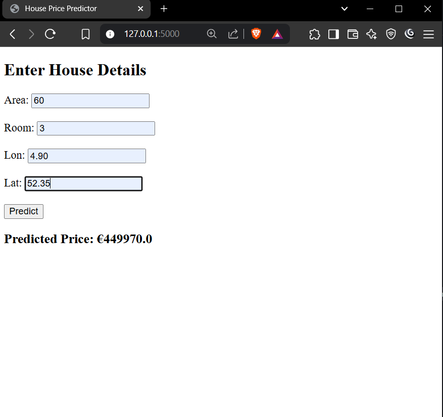
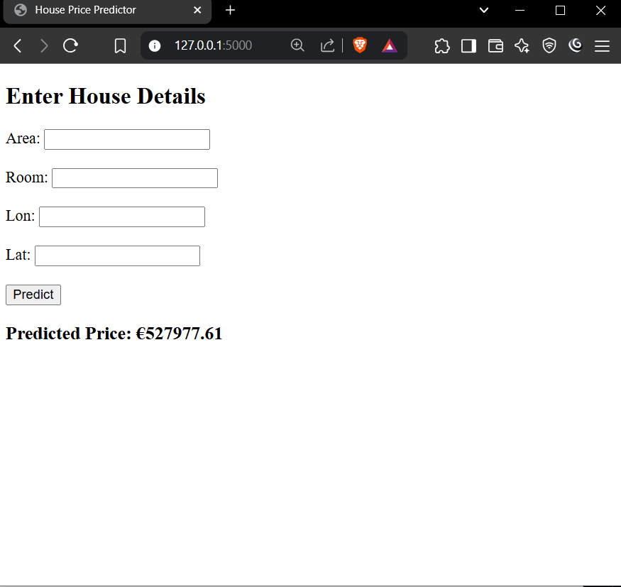

# House Price Prediction App (Amsterdam Housing Dataset)
This is a Flask-based web application that predicts house prices in Amsterdam using a machine learning model trained with the Random Forest Regressor. Users can input various property features, and the app will output the estimated price.


## ⚙️ How It Works

1. `model.py`:
   - Loads and cleans the dataset.
   - Removes outliers and irrelevant columns.
   - Trains a `RandomForestRegressor`.
   - Saves the trained model and feature names.

2. `app.py`:
   - Loads the saved model and feature list.
   - Provides a web form for users to input property features.
   - Predicts and displays the estimated house price.

---

## 🧪 Requirements

Install dependencies with:

bash or Terminal
```python
pip install flask pandas scikit-learn joblib
```


## 🚀 Getting Started
### 1. Clone the repository
1. In bash or terminal
```python
git clone <https://github.com/pratikraogithub/House_Price_Predictor>
```

Then in terminal or bash type

```python
cd House_Price_Predictor
```
if you are already in "Another-house-price-predictor" then leave as it is

2. Place Amsterdam.csv in the root folder(In this case leave it as it is).

### 2. Train the model:
```python
python model.py
```

This will generate:
- rf_model.pkl: Trained model
- features.pkl: List of feature columns

### 3. Run the Flask app:
```python
python app.py
```

### 4. Visit the web app in your browser:
```python
http://127.0.0.1:5000/
```

Then insert input -  Area, Room, Lon, Lat(Take help of Amsterdam.csv file)

## Screenshots

Inset the values (note: take help of Amsterdam.csv)


Then hit the "Predict" button

The result is shown there and the input field gets empty after the prediction.


## 📌 Notes
- Make sure all input values in the form are numeric.
- The dataset used: Amsterdam.csv.
- While giving input take help Amsterdam.csv for langitude and lattitude also you can take help for area and room 
- Model used: Random Forest Regressor from scikit-learn.

